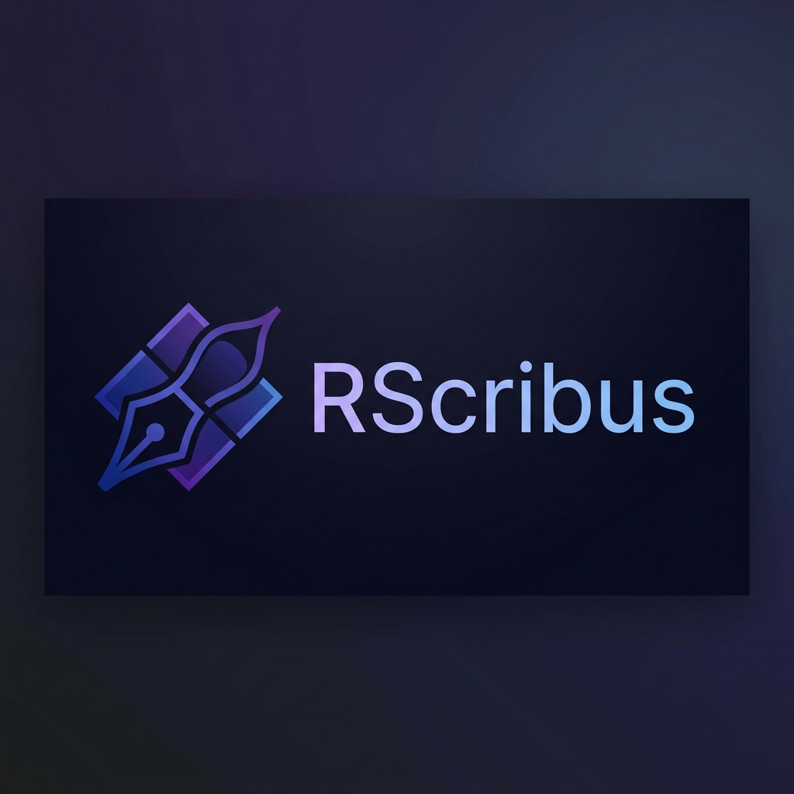

# RScribus



**RScribus** is a modern, high-performance layout and desktop publishing (DTP) tool built with **Rust** and **GTK4/Libadwaita**. It combines the safety and speed of Rust with a beautiful, native Linux user interface to provide a professional WYSIWYG editing experience.

## ✨ Features

- 📄 **Multi-page Support**: Create and manage complex documents with multiple pages.
- 📐 **Standard Layouts**: Default support for A4 dimensions (210x297mm) and real-world unit mapping.
- 📐 **Direct Canvas Interaction**:
  - **Drag-to-Create**: Intuitive text frame creation by clicking and dragging.
  - **Precision Selection**: Easily select items with visual feedback.
  - **Rotation & Geometry**: Support for object rotation and precise positioning.
  - **Smart Movement & Resizing**: 8-handle resizing system for pixel-perfect control.
- ✍️ **Advanced WYSIWYG Editing**:
  - **In-place Text Editing**: Double-click any text frame to edit content directly on the canvas.
  - **Overlay Editor**: A specialized `TextView` appears exactly where your content is, ensuring what you see is what you get.
  - **Auto-save**: Never lose progress; changes are saved automatically when focus is lost.
- 🔍 **Contextual Intelligence**: Right-click any element to see detailed statistics (paragraphs, lines, words, and characters).
- 💾 **Persistence**: Documents are serialized using JSON for easy sharing and versioning.
- 🎨 **Modern Aesthetics**: Built using `Libadwaita`, following the latest GNOME design guidelines for a clean, premium feel.

## 🚀 Technical Architecture

RScribus is built on a robust foundation:

- **Language**: [Rust](https://www.rust-lang.org/) for memory safety and peak performance.
- **UI Framework**: [Relm4](https://relm4.org/) (an idiomatic GTK4 wrapper) + [Libadwaita](https://gnome.pages.gitlab.gnome.org/libadwaita/).
- **Rendering Engine**: [Cairo](https://www.cairographics.org/) for high-quality 2D vector graphics.
- **Scaling**: Fixed at 3 px/mm, allowing for accurate real-world dimension mapping and print-ready layouts.

## 🛠 Installation & Setup

### Prerequisites

Ensure you have the following dependencies installed on your system (Ubuntu/Debian example):

```bash
sudo apt install libgtk-4-dev libadwaita-1-dev libcairo2-dev libpango1.0-dev
```

### Building from Source

1. Clone the repository:
   ```bash
   git clone https://github.com/your-username/RScribus.git
   cd RScribus
   ```

2. Build and run:
   ```bash
   cargo run --release
   ```

## 📅 Roadmap

- [ ] **Image Support**: Integration of `ImageFrame` for rich media layouts.
- [ ] **Property Sidebar**: Fine-grained numerical editing for object positions and dimensions.
- [ ] **Shapes**: Support for geometric primitives (rectangles, circles, etc.).
- [ ] **Shortcuts**: Implementation of Delete/Duplicate and standard DTP shortcuts.
- [ ] **Export**: PDF export functionality.

## 📄 License

This project is licensed under the MIT License - see the [LICENSE](LICENSE) file for details.

---

*Made with ❤️ using Rust and GTK.*
